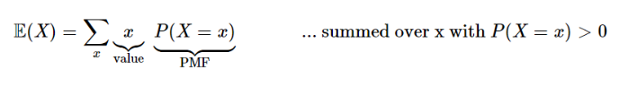

# 9강- 기댓값, 지시확률변수와 선형성

- **오늘의 주제**: 평균
- **키워드**
    - `누적분포함수(CDF)`
    - `독립 확률변수`
    - `기댓값(expectation)`
    - `지시확률변수`
    - `선형성(linearity)`
    - `기하분포`

## 확률변수의 기대값(Average, Mean, Expected Value)

- **기댓값 (Expected Value)이란?**

    어떤 확률 과정을 무한히 반복했을 때 얻을 수 있는 값들의 평균으로 기대하는 값.

- **Expectation VS. Mean VS. Average 비교**
    - `Expectation`(기대치) vs Mean(평균)

        주사위를 5번 던졌다고 가정해보자. 샘플 값들은 1, 2, 5, 2, 3 이라고 나왔다.

        Mean = (1 + 2 + 5 + 2 + 3) / 5 = 13/5 = 2.6 이고,

        Expectaion = 3.5이다. (이상적으로 기대되는 숫자)

    [Basic Probability](https://seeing-theory.brown.edu/basic-probability/index.html)

    - Mean(평균) vs Average(평균)

        Mean(평균)에는 산술평균, 기하평균, 조화평균 등 다양한 종류의 평균값이 존재하는데, 그 중 Arithmetic Mean(산술 평균)을 Average라고 한다. 일상 대화에서 많이 쓰임.

- **9강에서 구하려는 이산확률변수의 기대값 종류**
    - **베르누이 확률변수의 기대값**
    - **이항확률변수의 기댓값**
    - **기하확률변수의 기대값**

### 이산확률변수의 기대값

가중 평균을 간단하게 나타냄.

이 정의를 이용하여 다양한 종류의 이산확률변수의 기대값을 구해보자.

### 베르누이 확률변수의 기대값

`베르누이 확률변수`는 0과 1의 값만을 가질 수 있는 경우이다.

### 지시확률변수의 기대값

사건 A의 발생 여부에 종속하여 특정 값(1, 0)을 갖는 변수

사건 A가 일어나면 1, 그 외에는 0

이 때, `지시확률변수`의 기대값은 사건 A가 일어날 확률과 같은데, 이를 근본적인 다리라고 한다.

Fundamental Bridge

### 이항확률변수의 기대값

- **기대값의 선형성**
    1. $ E(X+Y)=E(X)+E(Y) $ → $X, Y$가 서로 독립이 아닌 경우에도 성립!
    2. $E(cX)=cE(X)$ (c는 상수)

- **이산확률변수의 기대값을 이용**

    

- **기대값의 선형성을 이용**

$X = X_1+ ... +X_n$ 이기 때문에

($X_i$ 는 각각 베르누이 시행)

$E(X)=n⋅E(X​1​​)=np$ 

